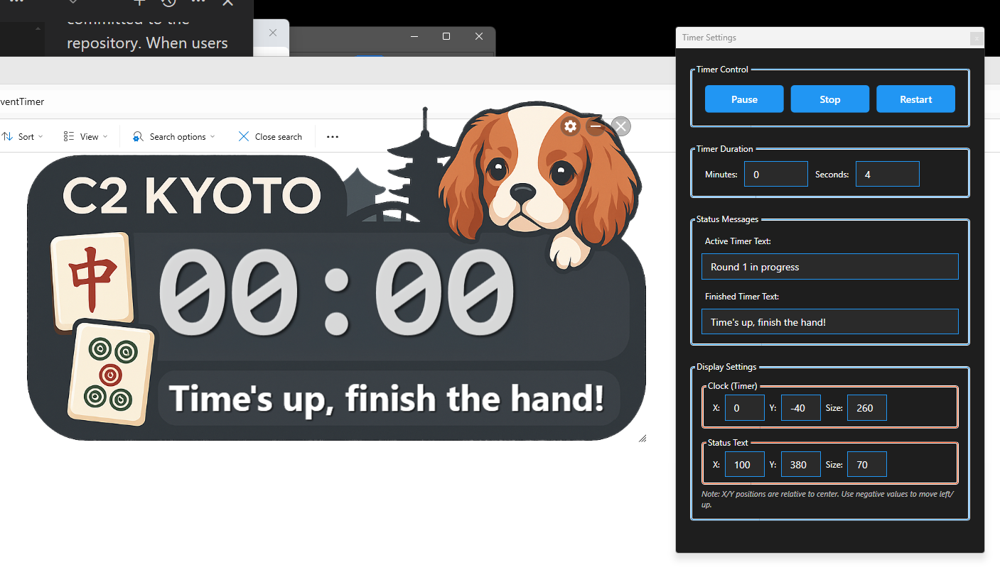

# RTEventTimer - Real-Time Event Timer for Windows

A modern, always-on-top countdown timer application for Windows with transparent background support, designed for use in mahjong parlors or any environment requiring a highly visible countdown display.

<a href="Assets/screenshot.png"></a>

## Features

- **Large Digital Clock**: Displays countdown accurate to tenths of a second
- **Always On Top**: Timer window stays above all other windows
- **Transparent Background**: Uses PNG with transparency for seamless overlay
- **Customizable Messages**: Set different text for active and finished states
- **Timer Controls**: Start, Stop, Pause, and Restart functionality
- **Audio Alert**: Plays sound when timer reaches zero
- **Visual Alert**: Flashing animation when timer completes
- **Customizable Assets**: Easily replace sounds and background image and adjust the text positions to match.
- **Adjustable**: You can freely reposition by dragging it, and resize by using the scale handle on the bottom right.


## Quick Start (For End Users)

1. Download [`RTEventTimer_Windows.zip`](RTEventTimer_Windows.zip) (codesigned by Robinson Technologies)
2. Extract the ZIP file to a folder
3. Double-click `RTEventTimer.exe` to run
4. No installation required!

### Customizing Appearance and Sounds

The Assets folder contains files you can replace:
- `background.png` - Timer background (1920x270 pixels with transparency)
- `timer_finished.wav` - Sound when timer reaches zero
- `button1.wav` - Sound when buttons are clicked

Simply replace these files with your own (keeping the same filenames) to customize the timer.

## Usage

1. **Moving the Window**: Click and drag anywhere on the timer display to reposition
2. **Opening Settings**: Click the gear icon in the top-right corner
3. **Timer Controls**:
   - **Start**: Begin or resume the countdown
   - **Pause**: Temporarily stop the countdown (can resume)
   - **Stop**: Stop and reset the timer
   - **Restart**: Stop and immediately restart with the set duration
4. **Customization**:
   - Set countdown duration in minutes and seconds
   - Customize the "active" message shown during countdown
   - Customize the "finished" message shown when timer reaches zero

## Building from Source

### Prerequisites

- .NET 6.0 SDK or later
- Windows 10/11
- 7-Zip (for packaging, path set in build script)


#### Automated Build (Recommended)

Run the build script to create a signed, single-file executable:

```batch
build_and_package.bat
```

This will:
- Build a self-contained single executable
- Sign the executable (requires signing environment)
- Package everything into a ZIP file
- Output: `RTEventTimer_Windows.zip`


## License

zlib

## Author

**Seth A. Robinson**
- Website: [www.rtsoft.com](https://www.rtsoft.com)
- Blog: [www.codedojo.com](https://www.codedojo.com)

## AI disclaimer

This application was developed with assistance from AI technology.